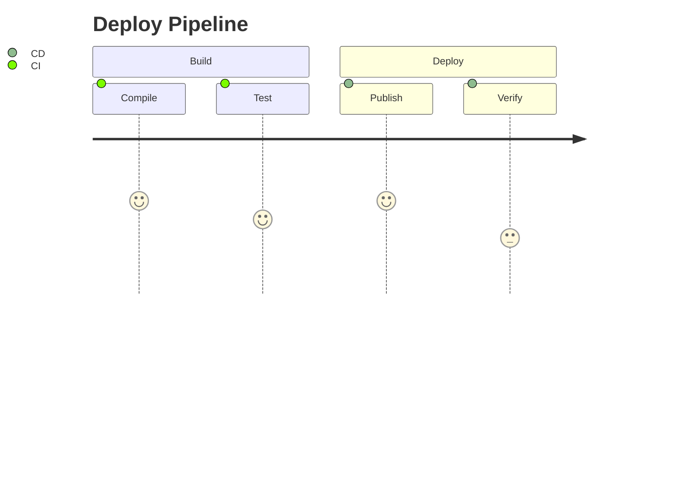

# Scenario Content

Each subfolder is a documentation page for a jumpstart, served at `/fabric_jumpstart/<logical_id>`.

```
<logical-id>/
├── index.mdx   ← or index.md (you cannot have both, tests will fail)
└── images/
    ├── architecture.png
    └── demo.gif
```

Folder name must match the jumpstart's `logical_id`. Folders starting with `_` are ignored.

## Frontmatter

```yaml
---
title: My Jumpstart          # required
toc: true                    # table-of-contents sidebar (mdx only, default: true)
---
```

## MD vs MDX

`.md` — standard Markdown (headings, lists, tables, fenced code blocks, images, blockquotes).

`.mdx` — everything in `.md` **plus** the custom components below. No imports needed; they're pre-registered in `ScenarioContentRenderer.tsx`.

## Components (MDX only)

**`<Callout>`** — tip/warning box with a branded left border. Leave blank lines around inner content so Markdown parses correctly.

```mdx
<Callout>

💡 Requires an F2 capacity or higher!

</Callout>
```

**`<QuoteBlock>`** — styled attribution quote (`author` and `source` are optional).

```mdx
<QuoteBlock author="Fabric Team" source="Best Practices">
Use Delta format for ACID transactions and time travel.
</QuoteBlock>
```

**`<YouTubeEmbed>`** — responsive 16:9 embed. Any YouTube URL format works.

```mdx
<YouTubeEmbed url="https://www.youtube.com/watch?v=VIDEO_ID" />
```

## Images

Relative paths are rewritten to public URLs at build time. External URLs work as-is.

```markdown


```

## Mermaid diagrams

Fenced code blocks with the `mermaid` language tag are rendered as diagrams. All [mermaid diagram types](https://mermaid.js.org/intro/) are supported (flowcharts, sequence, journey, pie, etc.). Diagrams automatically adapt to the site's light/dark theme.

````mdx

````
