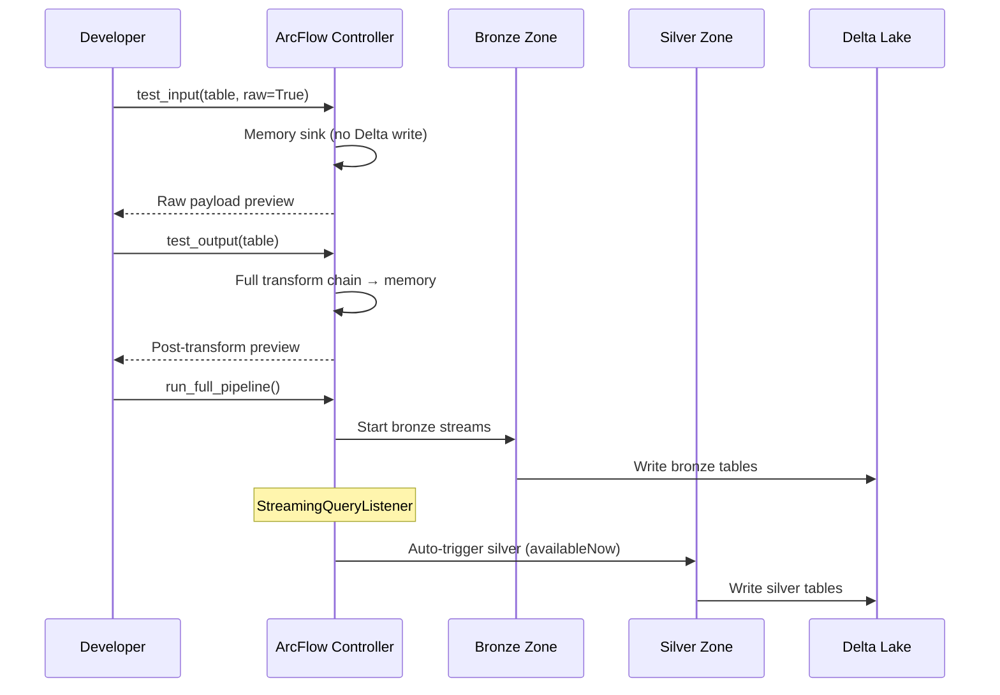
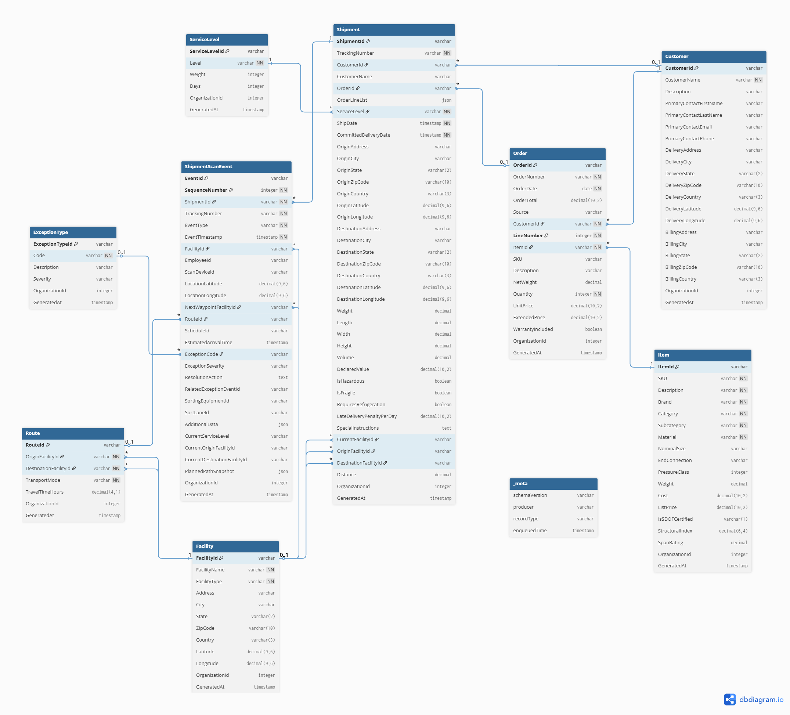

This jumpstart deploys a full **Spark Structured Streaming** lakehouse into your Microsoft Fabric workspace — a production-grade medallion pipeline (raw → bronze → silver) processing 9 entities from file and Eventstream sources, powered by [ArcFlow](https://github.com/mwc360/ArcFlow), an open-source PySpark streaming ELT framework.

<Callout>

🌊 Experience stateful streaming in action — watch data flow through a multi-zone lakehouse architecture with incremental processing, automatic state management, and event-driven declarative orchestration.

</Callout>

## What You'll Learn

This jumpstart is designed as a hands-on workshop (Module 2 of the Stateful Streaming Lakehouse series). It covers two progression levels:

| Part | Notebook | Focus |
|------|----------|-------|
| **Part 1** | `explore_streaming` | Core streaming concepts with plain PySpark — no frameworks |
| **Part 2** | `arcflow_elt_framework` | Same transforms, now packaged as production software with ArcFlow |

By the end you will have:

- Built a working **raw → bronze → silver** streaming pipeline
- Understood **checkpoint state** — how Spark remembers what it already processed
- Used the **`memory` sink** to develop safely without writing to Delta
- Seen how **packaging transforms as a framework** changes testability, observability, and scalability
- Understood the power of Sparks Structured Streaming API for **managing state** in both streaming and batch use cases

### Entities

| Entity | Landing Format | Source | Custom Logic |
|--------|---------------|--------|-------------|
| shipment_scan_event | Eventstream (Kafka) | Real-time event stream | Explode + flatten 30+ fields |
| shipment | JSON files | `Files/landing/` | Flatten nested addresses |
| order | JSON files | `Files/landing/` | Explode `OrderLines[]` to line-level grain |
| item | JSON files | `Files/landing/` | Cast types, validate SKU |
| customer | Parquet files | `Files/landing/` | Flatten address structs |
| route | Parquet files | `Files/landing/` | Dimensional lookup |
| facility | Parquet files | `Files/landing/` | Dimensional lookup |
| servicelevel | Parquet files | `Files/landing/` | Dimensional lookup |
| exceptiontype | Parquet files | `Files/landing/` | Dimensional lookup |

JSON files follow an envelope pattern: `{"_meta": {...}, "data": [...]}`. Parquet files are flat with `OrganizationId` and `GeneratedAt` columns added by the data generator.

## How It Works

### Part 1 — Core Concepts with Native Spark

The `explore_streaming` notebook walks through streaming primitives with zero abstractions:

1. **Why Structured Streaming for batch pipelines?** — The `availableNow` trigger gives you batch scheduling semantics with streaming state management. Re-run a job and it only processes new data.

2. **Write streaming queries on top of files** — Read a file source as a stream, write to Delta with a checkpoint. Re-run it and watch only new data process.

3. **The `memory` sink development pattern** — Stream data into driver memory to inspect and iterate on transforms without touching Delta tables. No checkpoints, no cleanup.

4. **Eventstream (Kafka) source pattern** — The same transforms work whether the source is files or a message broker. Parse the binary Kafka payload through cast → `from_json` → explode → expand.

5. **Build raw → bronze → silver** — Schema enforcement, `snake_case` column normalization, audit timestamps in bronze. Flatten and expand nested structs in silver.

<Callout>

🛡️ **Why normalize column names in bronze?** Source systems are unpredictable — column names may arrive as `PascalCase`, `camelCase`, contain spaces, or mix conventions across producers. Normalizing early means every downstream consumer gets a consistent contract from day one.

</Callout>

### Part 2 — Thinking Like a Software Engineer

The `arcflow_elt_framework` notebook takes the exact same transforms and packages them with ArcFlow:

| Concept | What changes |
|---------|-------------|
| **Loose notebook functions** → **`@register_zone_transformer`** | Transforms are named, discoverable, and referenced by config |
| **Manual `writeStream` boilerplate** → **YAML configuration** | Define sources, zones, and transforms declaratively |
| **One stream at a time** → **`controller.run_full_pipeline()`** | All tables, all zones, one call |
| **`query.status` per stream** → **`controller.get_status()`** | Every stream's health in one call |
| **Manual zone sequencing** → **Event-driven chaining** | `StreamingQueryListener` cascades downstream zones automatically |
| **Ad-hoc Spark configs** → **`SparkConfigurator`** | Auto-applies AQE, auto-compaction, V-Order, zstd compression on init |

The `test_input` / `test_output` methods let you validate the full transform chain end-to-end — raw through silver — **without writing a single row to storage**.



### Spark Job Definition

The production pipeline runs as a headless [Spark Job Definition](https://learn.microsoft.com/fabric/data-engineering/create-spark-job-definition) (`main.py`) that:

1. Starts the [LakeGen](https://github.com/mwc360/LakeGen) **McMillan Industrial Group** synthetic data generator — producing orders, shipments, scan events, and reference data
2. Initializes the **ArcFlow Controller** with pipeline configuration
3. Runs `controller.run_full_pipeline(zones=['bronze', 'silver'])` with `await_termination=True`

The same framework, same config, same transforms — just a different execution model. See [Notebooks vs. Spark Jobs in Production](https://milescole.dev/data-engineering/2026/02/04/Notebooks-vs-Spark-Jobs-in-Production.html) for the tradeoffs, and [Creating Your First Spark Job Definition](https://milescole.dev/data-engineering/2026/02/04/Creating-your-first-Spark-Job-Definition.html) for a step-by-step guide.

## Key Patterns

### Stateful Incremental Processing

Every streaming query uses **checkpoint state** to track what has been processed. Re-running a pipeline only processes new data — no duplicates, no full re-scans, no custom bookmarking logic.

```python
query = (df.writeStream
    .format('delta')
    .option('checkpointLocation', 'Files/checkpoints/my_table')
    .trigger(availableNow=True)
    .toTable('bronze.my_table')
)
```

### File Archival for Streaming from Object Storage

<Callout>

⚠️ When streaming from object storage (OneLake, ADLS, S3), Spark must **list all files in the directory** on every trigger. As files accumulate, this listing grows linearly and can become the dominant pipeline cost. Use Spark's built-in archival to keep the landing directory small:

```python
df = (spark.readStream
    .option('cleanSource', 'archive')
    .option('sourceArchiveDir', 'Files/archive/my_source/')
    ...
)
```

Message brokers avoid the problem entirely — offset tracking is O(1) regardless of history depth.

</Callout>

## Target Schema

By the end of the workshop, you'll have a complete silver layer:



## Resources

- [Spark Structured Streaming Programming Guide](https://spark.apache.org/docs/3.5.6/structured-streaming-programming-guide.html)
- [Delta Lake Streaming Reads and Writes](https://docs.delta.io/latest/delta-streaming.html)
- [ArcFlow on GitHub](https://github.com/mwc360/ArcFlow) — open-source PySpark streaming ELT framework
- [Notebooks vs. Spark Jobs in Production](https://milescole.dev/data-engineering/2026/02/04/Notebooks-vs-Spark-Jobs-in-Production.html)
- [Creating Your First Spark Job Definition](https://milescole.dev/data-engineering/2026/02/04/Creating-your-first-Spark-Job-Definition.html)
- [Should You Infer Schema in Production?](https://milescole.dev/data-engineering/2026/02/20/Infer-Schema-In-Production.html)
- [Fabric Dimensional Modeling](https://www.kimballgroup.com/data-warehouse-business-intelligence-resources/kimball-techniques/dimensional-modeling-techniques/)
