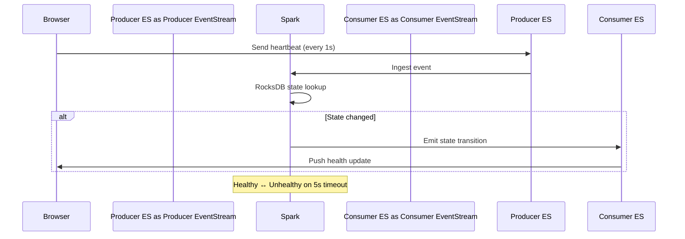
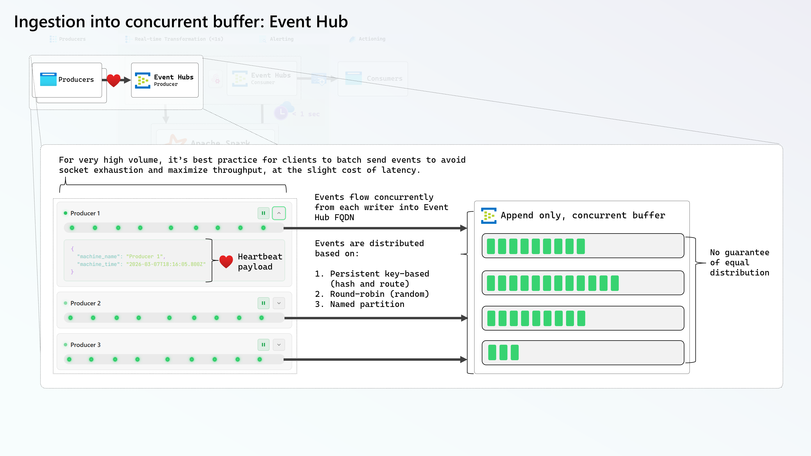
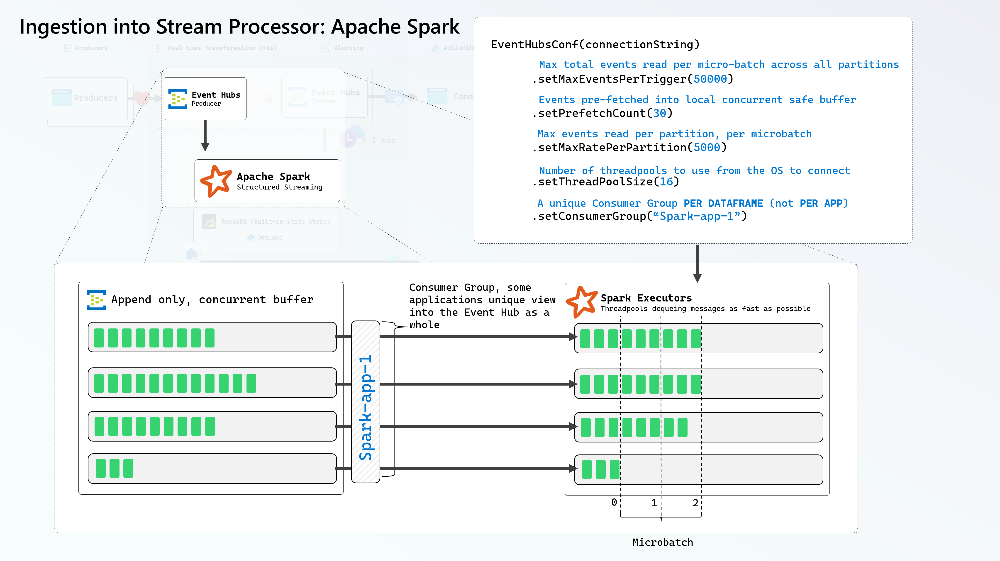
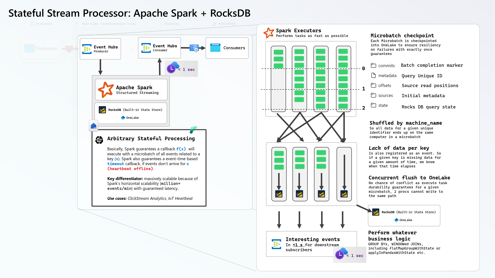

This jumpstart deploys a stateful stream processing demo using Spark Structured Streaming with RocksDB hosted on OneLake into your Microsoft Fabric workspace.

<Callout>

⚡ You're about to experience the full power of Spark Streaming with sub-second (<1 second) latency right in your browser.

</Callout>

## Getting Started

After installing the jumpstart, visit the [companion website](https://heartbeatspark.z9.web.core.windows.net) to create heartbeat producers and consumers right in your browser.

## Architecture

## How It Works

- **Producers** on the website send heartbeat events every second
- **Spark** groups events by `machine_name` and tracks state transitions using RocksDB
- State machine: `None → Initializing → Healthy ↔ Unhealthy (on 5s timeout)`
- Only emits output when state **changes**, **not** on every heartbeat. This allows us to effectively treat RocksDB as a distributed buffer so we get notified on interesting events at low latency.
- **Pause** a producer to watch it go Unhealthy after 5 seconds

### Browser Producer Client to Event Hub

The browser uses an [EventHubProducerClient](https://github.com/mdrakiburrahman/heartbeat-website/blob/65d04ac582edf0248ad06a259692021e642aad67/src/lib/useEventHubProducer.ts#L108), which adds [a single message](https://github.com/mdrakiburrahman/heartbeat-website/blob/65d04ac582edf0248ad06a259692021e642aad67/src/lib/useEventHubProducer.ts#L161) to a batch and sends it to Event Hub for this simple demonstration every second. To maximize throughput and avoid socket exhaustion, the best practice would be to add as many messages as possible, until the batch limit is reached - see [`TryAdd`](https://github.com/Azure/azure-sdk-for-net/blob/1901667b1d2c281b2c862bde7800809f27b4114d/sdk/eventhub/Azure.Messaging.EventHubs/src/Core/TransportEventBatch.cs#L60).

The client can durably control the partition the event will end up in by specifying a [`PartitionKey`](https://github.com/Azure/azure-sdk-for-net/blob/1901667b1d2c281b2c862bde7800809f27b4114d/sdk/eventhub/Azure.Messaging.EventHubs/src/Producer/SendEventOptions.cs#L41). Note that this is NOT the actual partition ID, but rather, providing a hint to the Event Hub SDK in the form of a string, that will be hashed so all events with this hash are guaranteed to route to the same partition.

### Spark parallelized MicroBatch Ingestion from Event Hub

The Event Hub SDK implements the Spark RDD interface in [`EventHubsRDD`](https://github.com/Azure/azure-event-hubs-spark/blob/master/core/src/main/scala/org/apache/spark/eventhubs/rdd/EventHubsRDD.scala), which uses [local threadpools](https://github.com/Azure/azure-event-hubs-spark/blob/master/core/src/main/scala/org/apache/spark/eventhubs/client/ClientConnectionPool.scala) per Executor to dequeue messages from the Event Hub as fast as possible within a Microbatch.

There are a [large number of tunables](https://github.com/Azure/azure-event-hubs-spark/blob/master/core/src/main/scala/org/apache/spark/eventhubs/EventHubsConf.scala) the end-user can set to control the behavior of the Spark Executor during ingestion.

### Spark Stateful Processing with RocksDB

Extremely low latency is reached on a small Spark Cluster for this demonstration by [setting Shuffle Partitions to 1](https://github.com/mdrakiburrahman/heartbeat-website/blob/65d04ac582edf0248ad06a259692021e642aad67/workspace/heartbeat_notebook.Notebook/notebook-content.py#L82). To yield events when a producer goes offline, the stream is [`GROUPED BY`](https://github.com/mdrakiburrahman/heartbeat-website/blob/65d04ac582edf0248ad06a259692021e642aad67/workspace/heartbeat_notebook.Notebook/notebook-content.py#L147) the unique producer identity (in this case `machine_name`), and a State Machine function [`heartbeat_state_transition`](https://github.com/mdrakiburrahman/heartbeat-website/blob/65d04ac582edf0248ad06a259692021e642aad67/workspace/heartbeat_notebook.Notebook/notebook-content.py#L113) iterates in parallel per microbatch callback on incoming data per key (`machine_name`), to implement further business logic.

State from the above `GROUP BY` is stored transparently in [RocksDB](https://github.com/facebook/rocksdb), a highly performant Key:Value database with concurrent flush support, and durability guaranteed by Object Store (in this case, OneLake). Upon stream crash/shutdown, Spark is able to reconstruct previously stored state from RocksDB and resume processing where it left off, without data loss and with minimal downtime. By using event time for the watermark, we're able to ensure that even if the Stream goes down for several days, we continue on with the calculation upon restart without sacrificing correctness - see [RocksDBStateStoreProvider](https://github.com/apache/spark/blob/branch-3.5/sql/core/src/main/scala/org/apache/spark/sql/execution/streaming/state/RocksDBStateStoreProvider.scala).

This pattern scales extremely well, because each Spark Job is guaranteed to own it's checkpoint folder, therefore each Spark Job has it's own personal database to scale arbitraily high. Given the large throughput and concurrency gurantees of OneLake, this patterns scales near infinitely via horizontal scaling.

## Resources

- [Spark Structured Streaming Programming guide](https://spark.apache.org/docs/latest/streaming/index.html)
- [Spark Stateful Streaming](https://spark.apache.org/docs/latest/streaming/structured-streaming-transform-with-state.html)
- [Event Hub partitioning concepts](https://learn.microsoft.com/en-us/azure/event-hubs/event-hubs-features)
- [Event Hub performance tunables](https://github.com/Azure/azure-event-hubs-spark/blob/a1d92a93dcfdf5b68a46169c6c43750df3231afc/docs/structured-streaming-eventhubs-integration.md#eventhubsconf)